# LifeSync AI - Complete Production Authentication & Operating System

LifeSync AI is an AI-powered personal life management system featuring multimodal document OCR, RAG retrieval, proactive cross-domain risk alerts, and a production-grade authentication architecture.

---

## 🏗 System Architecture & Layering

Strict unidirectional layering: `Router -> Service -> Repository -> Model`

- **FastAPI Backend**: Standardized error response shape `{ "error": { "code": "...", "message": "...", "fields": {...} } }`, rate limiting via `slowapi`, JWT access tokens in memory (15 min), httpOnly opaque refresh token cookies with token family rotation & theft detection, and 5-failure account lockout (15 min).
- **Next.js Frontend**: Next.js 16 App Router, React 19, TypeScript 5, Tailwind CSS, Zod validation, single-flight refresh queueing, edge middleware redirects via `ls_session` cookie, and role-based guards.

---

## 🔄 Authentication Sequence Diagram

```mermaid
sequenceDiagram
    autonumber
    actor User as User Browser
    participant FE as Next.js Frontend
    participant BE as FastAPI Backend
    participant DB as Database (SQLite/Postgres)
    participant Email as Email Service

    %% Register Flow
    rect rgb(24, 24, 27)
    note right of User: 1. Registration
    User->>FE: Fills Registration Form (Full Name, Email, Password)
    FE->>BE: POST /api/v1/auth/register
    BE->>DB: Check if User exists
    alt Email already exists
        BE->>Email: Send "Already Registered" Notice
        BE-->>FE: Return 201 Success (Anti-Enumeration)
    else New Email
        BE->>DB: Save Unverified User & OneTimeToken (24h)
        BE->>Email: Send Verification Link (token)
        BE-->>FE: Return 201 Success
    end
    FE-->>User: Redirect to /check-email
    end

    %% Email Verification Flow
    rect rgb(24, 24, 27)
    note right of User: 2. Verification
    User->>FE: Clicks email link (/verify-email?token=...)
    FE->>BE: POST /api/v1/auth/verify-email {token}
    BE->>DB: Consume token & mark email_verified_at
    BE-->>FE: 200 Email Verified
    FE-->>User: Display Success UI
    end

    %% Login Flow
    rect rgb(24, 24, 27)
    note right of User: 3. Login & Session Creation
    User->>FE: Submits credentials (/login)
    FE->>BE: POST /api/v1/auth/login {email, password, remember_me}
    BE->>DB: Verify bcrypt hash & check lockout
    BE->>DB: Create AuthSession & Refresh Token Hash
    BE-->>FE: 200 {access_token, user} + httpOnly Cookie (refresh_token) + Cookie (ls_session=1)
    FE->>FE: Store access_token in React Memory State
    FE-->>User: Redirect to /dashboard
    end

    %% Refresh Rotation Flow
    rect rgb(24, 24, 27)
    note right of User: 4. Single-Flight Token Refresh Rotation
    User->>FE: Performs API action (Access token expired 401)
    FE->>BE: POST /api/v1/auth/refresh (httpOnly Cookie)
    BE->>DB: Validate Session Token Hash
    alt Active Valid Session
        BE->>DB: Revoke old Session, Issue new Session (replaced_by_id)
        BE-->>FE: 200 {new_access_token} + New httpOnly Refresh Cookie
        FE->>FE: Retry original request once
    else Revoked Token Presented (Theft!)
        BE->>DB: Revoke ENTIRE Session Family (family_id)
        BE-->>FE: 401 session_revoked
        FE-->>User: Clear State & Redirect to /login
    end
    end

    %% Logout Flow
    rect rgb(24, 24, 27)
    note right of User: 5. Logout
    User->>FE: Clicks Logout
    FE->>BE: POST /api/v1/auth/logout
    BE->>DB: Revoke current Session
    BE-->>FE: 200 OK + Clear Cookies
    FE-->>User: Redirect to /login
    end
```



---

## 📡 API Endpoint Reference

| Method | Endpoint | Description | Auth Required |
|---|---|---|---|
| `POST` | `/api/v1/auth/register` | Register new unverified account (Anti-enumeration) | No |
| `POST` | `/api/v1/auth/verify-email` | Verify email via 24h single-use token | No |
| `POST` | `/api/v1/auth/resend-verification` | Resend email verification link | No (Rate-limited) |
| `POST` | `/api/v1/auth/login` | Authenticate user, issue access token & httpOnly refresh cookie | No (Rate-limited) |
| `POST` | `/api/v1/auth/refresh` | Rotate refresh token & issue new access token | Refresh Cookie |
| `POST` | `/api/v1/auth/logout` | Revoke current session & clear cookies | Refresh Cookie |
| `POST` | `/api/v1/auth/logout-all` | Revoke all active sessions for current user | Bearer JWT |
| `POST` | `/api/v1/auth/forgot-password` | Send 30-min single-use password reset link | No (Rate-limited) |
| `POST` | `/api/v1/auth/reset-password` | Reset password using token & revoke all user sessions | No |
| `POST` | `/api/v1/auth/change-password` | Change password for logged-in user & revoke other sessions | Bearer JWT |
| `GET` | `/api/v1/users/me` | Fetch current user profile | Bearer JWT |
| `PATCH` | `/api/v1/users/me` | Update current user full name | Bearer JWT |
| `GET` | `/api/v1/users/me/sessions` | List active logged-in device sessions | Bearer JWT |
| `DELETE` | `/api/v1/users/me/sessions/{id}` | Revoke a specific active device session | Bearer JWT |
| `GET` | `/api/v1/users/me/activity` | Paginated security activity audit trail | Bearer JWT |
| `GET` | `/api/v1/admin/users` | Admin user directory (Requires `role == "admin"`) | Bearer JWT (`admin`) |

---

## 🚀 Setup & Installation Instructions

### Option A: Local Development (SQLite)

1. **Backend Setup**:
   ```bash
   cd backend
   python -m venv venv
   source venv/bin/activate
   pip install -r requirements.txt
   
   # Run migrations & seed admin user
   alembic upgrade head
   python -m app.seed

   # Run FastAPI server
   uvicorn app.main:app --reload --port 8000
   ```

2. **Frontend Setup**:
   ```bash
   cd frontend
   npm install
   npm run dev
   ```

3. Open `http://localhost:3000` in your browser.
   - Admin credentials: `admin@lifesync.ai` / `AdminPass123!`

---

### Option B: Production Deployment (Docker Compose + PostgreSQL)

```bash
# Build and launch PostgreSQL, FastAPI Backend, and Next.js Frontend
docker-compose up --build -d
```

---

## 🧪 Verification & Automated Tests

- **Backend Pytest Suite**:
  ```bash
  cd backend
  venv/bin/pytest tests/test_auth.py tests/test_ocr_rag.py
  ```

- **Frontend Production Build & Typecheck**:
  ```bash
  cd frontend
  npm run build
  ```

---

## ✅ Manual Test Checklist

- [x] **Registration**: Register with a new email address. Verify email arrives in console log.
- [x] **Anti-Enumeration**: Register with the same email again. Ensure identical 201 message is returned without error.
- [x] **Unverified Login Block**: Try logging in before verifying email. Ensure 403 `email_not_verified` is returned.
- [x] **Verification Link**: Click `/verify-email?token=...`. Ensure account marks as verified.
- [x] **Lockout Protection**: Input wrong password 5 times. Ensure 423 `account_locked` response with `Retry-After` header.
- [x] **Session Rotation & Theft Detection**: Perform refresh. Try reusing old refresh token; ensure all sessions in the family are revoked.
- [x] **Active Session Management**: Visit `/settings/security`, view active devices, and revoke an individual session.
- [x] **RBAC Enforcement**: Access `/admin/users` as a regular user (403 Forbidden) vs admin user (200 OK).